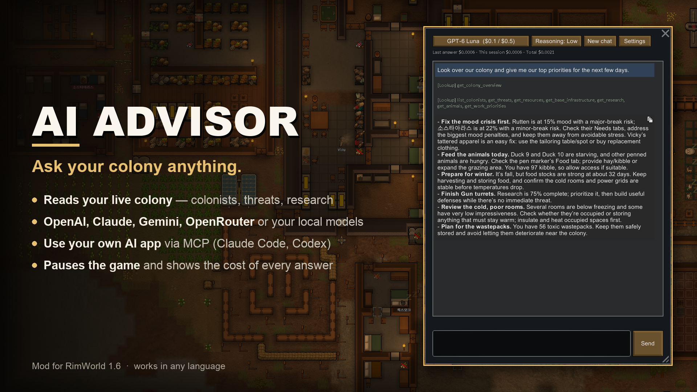
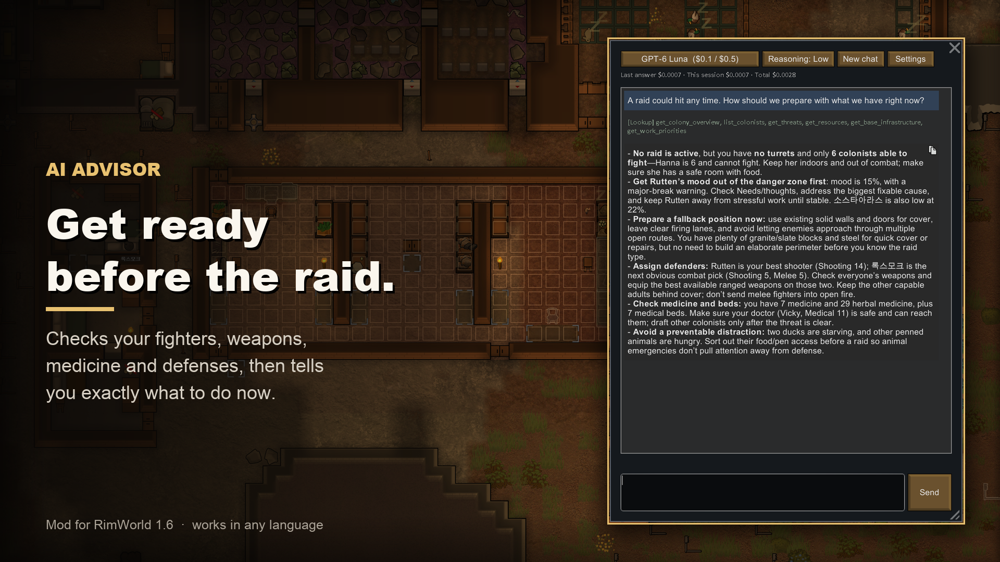
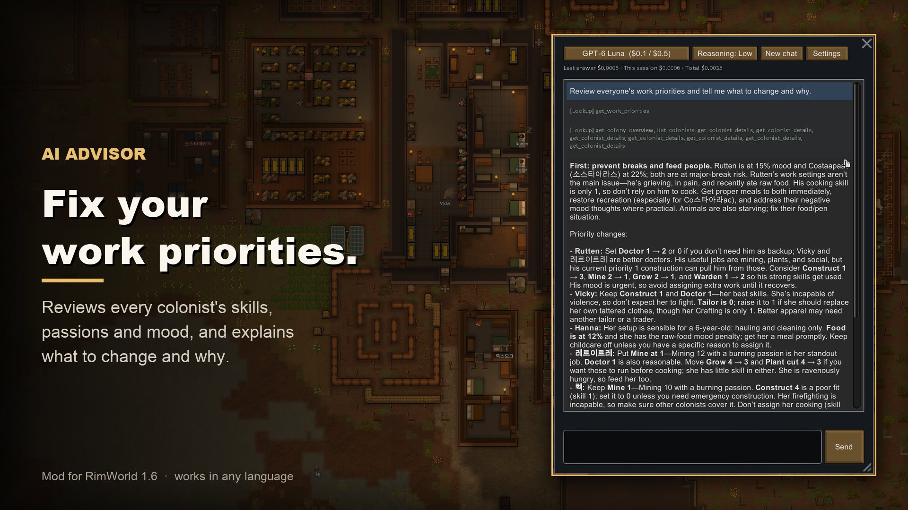

<div align="center">

# AI Advisor for RimWorld

**An AI strategy advisor that lives inside your game.**
It reads your colony's live data, then tells you what to do next.




</div>

---

## Why

RimWorld throws a lot at you: moods, raids, food, work priorities, research. AI Advisor looks at the **actual state of your colony** (not a generic wiki answer) and gives concrete, prioritized advice, in whatever language you ask.

<table>
<tr>
<td width="50%"></td>
<td width="50%"></td>
</tr>
<tr>
<td align="center"><b>Get ready before the raid</b><br><sub>Fighters, weapons, medicine and defenses, checked for you</sub></td>
<td align="center"><b>Fix your work priorities</b><br><sub>Every colonist's skills, passions and mood reviewed</sub></td>
</tr>
</table>

> All screenshots show real answers from GPT-6 Luna (reasoning: low) about a real colony. Each answer cost less than **$0.001**.

## Features

| | |
|---|---|
| 🔍 **Reads your live colony** | Colonists (skills, passions, traits, health, mood thoughts), resources, threats, research, work priorities, rooms, beds, power, animals, prisoners, recent events and whatever you have selected |
| 🤖 **Use the AI you like** | OpenAI, Claude, Gemini, OpenRouter, or your local models. The provider is detected from your API key |
| 🆓 **Free options** | Local models through Ollama / LM Studio, or connect your own AI app (Claude Code, Codex CLI, Gemini CLI) over MCP |
| 💰 **Cost you can see** | Estimated cost per answer, per session and in total, with an optional spending limit |
| ⏸️ **Stays out of your way** | Pauses the game when you ask (optional). Read-only: it never changes your colony |
| 🧠 **Reasoning control** | Pick the reasoning effort. Only the values your model accepts are listed |
| 🌍 **Any language** | The advisor replies in the language you write in. UI in English and Korean |

## What you can ask

```text
Look over the colony and give me our top 5 priorities for the next few days.
A raid could hit any time. How should we prepare with what we have right now?
Review everyone's work priorities and tell me what to change and why.
Winter is coming. Are food, heating and clothing enough? What's missing?
Which prisoner is worth recruiting, and who should be the warden?
Plan a research path toward electricity and better defenses.
Why is our mood so low lately, and how do we fix it?
```

## Getting started

1. **Install** the mod and enable it in the mod list.
2. **Options → Mod settings → AI Advisor**, then choose one:
   - **API key**: paste a key from OpenAI, Anthropic, Google AI Studio or OpenRouter. The provider is detected automatically.
   - **Local model**: start Ollama or LM Studio, click its preset, and pick a model.
   - **MCP**: enable the MCP server and register it in your AI app (see below).
3. **Load a colony** and click **AI advisor** in the bottom bar.
4. Type a question and press **Enter** (Shift+Enter for a new line).

Your settings are saved, so you only do this once.

## Connection modes

| Mode | Where you chat | Cost | What you need |
|---|---|---|---|
| **API key** | In-game chat window | Pay per token to your provider | A key from OpenAI / Anthropic / Google / OpenRouter |
| **Local model** | In-game chat window | Free | Ollama or LM Studio, with a model that supports tool calling (e.g. Qwen3, Llama 3.1+) |
| **MCP** | Your own AI app | Covered by the plan you already have | Claude Code, Codex CLI or Gemini CLI |

### MCP setup

Enable **MCP server** in the mod settings, then run the command for your app once:

```bash
# Claude Code
claude mcp add --transport http --scope user rimworld http://127.0.0.1:18765/mcp

# Codex CLI
codex mcp add rimworld --url http://127.0.0.1:18765/mcp

# Gemini CLI
gemini mcp add --transport http rimworld http://127.0.0.1:18765/mcp
```

Keep the game running with a colony loaded and ask your app something like *"Check my RimWorld colony and tell me what to do next."*

> [!NOTE]
> While the MCP server is on, the game keeps running when its window is in the background. Pause the game while you ask from another app.

## Q&A

<details>
<summary><b>Can the mod author see or collect my API key?</b></summary>

No. There is no server behind this mod and no telemetry. Your key is stored only on your PC, in RimWorld's Config folder (`Mod_AIAdvisor_AdvisorMod.xml`). It is sent only to the provider you chose (for example `api.openai.com`), over HTTPS, when you ask a question. The full source code is in this repository and in the mod's `Source` folder, so you can check this yourself.
</details>

<details>
<summary><b>Where is the key stored? How do I remove it?</b></summary>

In RimWorld's Config folder:

| OS | Path |
|---|---|
| Windows | `%USERPROFILE%\AppData\LocalLow\Ludeon Studios\RimWorld by Ludeon Studios\Config` |
| macOS | `~/Library/Application Support/RimWorld/Config` |
| Linux | `~/.config/unity3d/Ludeon Studios/RimWorld by Ludeon Studios/Config` |

It is plain text, so don't share that file. To remove the key, clear the field in the mod settings or delete the file.
</details>

<details>
<summary><b>How much does it cost?</b></summary>

You pay your provider directly, per token. A typical question reads a few kinds of game data. That usually costs well under one cent with small models (GPT-6 Luna, Gemini Flash-Lite, Claude Haiku) and a few cents with top models. The chat window shows the estimate for every answer, and you can set a spending limit. Local models and MCP cost nothing extra.
</details>

<details>
<summary><b>What data is sent to the AI?</b></summary>

Only the summaries the advisor asks for while answering (for example the colonist list or current threats), plus the names of your active DLCs and mods. Your save file is never sent.
</details>

<details>
<summary><b>Does it change my colony or slow down the game?</b></summary>

No. It only reads game data (the one exception is moving the camera to a colonist it mentions). It does nothing until you ask, and reading the data takes milliseconds.
</details>

<details>
<summary><b>Is it safe to add or remove mid-save?</b></summary>

Yes. The mod stores nothing in your save file.
</details>

<details>
<summary><b>I get an error.</b></summary>

- **HTTP 401**: the key is wrong or expired.
- **Insufficient quota / credit balance**: your provider account needs credits.
- **HTTP 429 / 5xx**: the server is busy. The mod retries automatically.
- **A model rejects a reasoning setting**: choose *Default*.
</details>

---

## Development

<details>
<summary><b>Project layout</b></summary>

```text
About/          ModMetaData (About.xml) and the workshop Preview.png
Assemblies/     Built AIAdvisor.dll (release build)
Defs/           Model list and prices (AIModelDefs.xml), bottom-bar button
Languages/      English and Korean UI strings
Source/         C# source (net472)
Promo/          Extra workshop images (not shipped)
tools/          make_release.sh
```

Model prices live in `Defs/AIModelDefs.xml`. When a provider changes its prices, edit that file. No rebuild is needed.
</details>

<details>
<summary><b>Build</b></summary>

Requires the .NET SDK (8 or newer). The project references the game's own assemblies. The default path is the macOS Steam install, so set `RimWorldManaged` if your game is somewhere else.

```bash
cd Source
dotnet build -c Release
# custom install path:
dotnet build -c Release -p:RimWorldManaged="/path/to/RimWorld/Data/Managed"
```
</details>

<details>
<summary><b>Release and workshop upload</b></summary>

```bash
tools/make_release.sh   # release build + copy only the shipped files into the game's Mods/AIAdvisor
```

1. Launch RimWorld through Steam and enable **Development mode**.
2. **Mods** → select **AI Advisor** → **Upload to Steam Workshop**.
3. After the first upload, `About/PublishedFileId.txt` is created. The next `make_release.sh` run copies it back here. Commit it so later uploads update the same workshop item.
</details>

<details>
<summary><b>Self-test (development builds only)</b></summary>

Self-test and screenshot code is compiled only with `-p:SelfTest=true`, and never in release builds.

```bash
dotnet build -c Release -p:SelfTest=true
AIADVISOR_SELFTEST=1 "<RimWorld executable>" -savedatafolder=<scratch folder> -quicktest
```

It loads a quick-test map in a separate save folder, runs every tool and logs the results to `Player.log`. Optional variables:

| Variable | Effect |
|---|---|
| `AIADVISOR_SELFTEST_LOCAL=<url>` | Run the full agent loop against a local OpenAI-compatible server |
| `AIADVISOR_SELFTEST_MCP=<port>` | Start the MCP server |
| `AIADVISOR_SELFTEST_SHOT=<png>` | Save a screenshot |
| `AIADVISOR_SELFTEST_SETTINGS=1` | Open the settings window |

Rebuild without `SelfTest` before committing the DLL.
</details>
